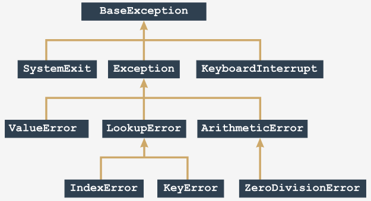

# Python Essentials 2 - PCAP-30-03 Certification

- [Python Essentials 2 - PCAP-30-03 Certification](#python-essentials-2---pcap-30-03-certification)
  - [Exam Syllabus](#exam-syllabus)
    - [Section 1: Modules and Packages (12%)](#section-1-modules-and-packages-12)
    - [Section 2: Exception (14%)](#section-2-exception-14)
    - [Section 3: Strings (18%)](#section-3-strings-18)
    - [Section 4: Object-Oriented Programming (34%)](#section-4-object-oriented-programming-34)
    - [Section 5: Miscellaneous (22%)](#section-5-miscellaneous-22)
  - [Module 1: Modules, Packages, and PIP](#module-1-modules-packages-and-pip)
    - [Importing Standard Python Modules](#importing-standard-python-modules)
      - [Examples](#examples)
    - [Working with Standard Modules](#working-with-standard-modules)
      - [The Math Module](#the-math-module)
        - [Trigonometry](#trigonometry)
        - [Exponentiation](#exponentiation)
        - [Math Functions](#math-functions)
      - [The Random Module](#the-random-module)
      - [The Platform Module](#the-platform-module)
      - [Python Standard Modules](#python-standard-modules)
      - [Module Exercises](#module-exercises)
    - [What is a Package?](#what-is-a-package)
      - [More Module Exercises](#more-module-exercises)
        - [Ex. 1: preventing arbatrary module code execution](#ex-1-preventing-arbatrary-module-code-execution)
        - [Ex. 2: system paths](#ex-2-system-paths)
        - [Ex. 3: importing packages using qualified imports](#ex-3-importing-packages-using-qualified-imports)
    - [Python Packaging Ecosystem](#python-packaging-ecosystem)
    - [Dependencies (using pip)](#dependencies-using-pip)
  - [Module 2: Strings, String Operations and Methods, and Python Exceptions and Errors](#module-2-strings-string-operations-and-methods-and-python-exceptions-and-errors)
    - [`Strings` in Computer Systems](#strings-in-computer-systems)
      - [Internationalization (I18N)](#internationalization-i18n)
      - [Codepoints \& Codepages](#codepoints--codepages)
      - [Unicode](#unicode)
        - [USC-4](#usc-4)
        - [UTF-8](#utf-8)
    - [`Strings` in Python](#strings-in-python)
    - [String Operations and Methods](#string-operations-and-methods)
      - [String Concatenation and Replication](#string-concatenation-and-replication)
      - [String Ordinals and Code Point Characters](#string-ordinals-and-code-point-characters)
      - [Indexing, Iterating, and Slicing a String](#indexing-iterating-and-slicing-a-string)
      - [The `in` and `not in` operators](#the-in-and-not-in-operators)
      - [String Methods](#string-methods)
      - [Comparing Strings](#comparing-strings)
      - [Sorting Strings](#sorting-strings)
      - [Converting Strings to Numbers/Floats](#converting-strings-to-numbersfloats)
      - [Python Strings Key Takeaways](#python-strings-key-takeaways)
    - [Expections and Errors](#expections-and-errors)
      - [Exception Handling](#exception-handling)
      - [Python Exception Hierarchy](#python-exception-hierarchy)
      - [Exceptions in Application](#exceptions-in-application)
      - [Assertions](#assertions)
      - [Exceptions Key Takeaways](#exceptions-key-takeaways)
  - [Module 3: Object-Oriented Programming](#module-3-object-oriented-programming)
    - [Object Fundamentals](#object-fundamentals)
      - [Procedural vs. Object-Oriented Programming](#procedural-vs-object-oriented-programming)
      - [Class Hierarchies](#class-hierarchies)
      - [Class Example: Stack](#class-example-stack)
    - [OOP Properties](#oop-properties)
      - [Instance Variables](#instance-variables)
      - [Built-in Properties](#built-in-properties)
      - [Class Variables](#class-variables)
    - [OOP Methods](#oop-methods)
    - [Reflection and Introspection](#reflection-and-introspection)
    - [OOP Fundamentals: Inheritance](#oop-fundamentals-inheritance)
  - [Module 4: Miscellaneous](#module-4-miscellaneous)

---

## Exam Syllabus

### Section 1: Modules and Packages (12%)

1. **PCAP-31-03 1.1** – Import and use modules and packages
   - import variants: import, from import, import as, import *
   - advanced qualifying for nested modules
   - the dir() function
   - the sys.path variable
2. **PCAP-31-03 1.2** – Perform evaluations using the math module
   - functions: ceil(), floor(), trunc(), factorial(), hypot(), sqrt()
3. **PCAP-31-03 1.3** – Generate random values using the random module
   - functions: random(), seed(), choice(), sample()
4. **PCAP-31-03 1.4** – Discover host platform properties using the platform module
   - functions: platform(), machine(), processor(), system(), version(), python_implementation(), python_version_tuple()
5. **PCAP-31-03 1.5** – Create and use user-defined modules and packages
   - idea and rationale;
   - the `__pycache__` directory
   - the `__name__` variable
   - public and private variables
   - the `__init__.py` file
   - searching for/through modules/packages
   - nested packages vs. directory trees

### Section 2: Exception (14%)

1. **PCAP-31-03 2.1** – Handle errors using Python-defined exceptions
   - except, except:-except, except:-else:, except (e1, e2)
   - the hierarchy of exceptions
   - `raise`, `raise Exception(...)`
   - `assert`
   - event classes
   - `except E as e`
   - the `arg` property
2. **PCAP-31-02 2.2** – Extend the Python exceptions hierarchy with self-defined exceptions
   - self-defined exceptions
   - defining and using self-defined exceptions

### Section 3: Strings (18%)

1. **PCAP-31-03 3.1** – Understand machine representation of characters
   - encoding standards: ASCII, UNICODE, UTF-8, codepoints, escape sequences
2. **PCAP-31-03 3.2** – Operate on strings
   - functions: ord(), chr()
   - indexing, slicing, immutability
   - iterating through strings, concatenating, multiplying, comparing (against strings and numbers)
   - operators: in, not in
3. **PCAP-31-03 3.3** – Employ built-in string methods
   - methods: .isupper(), .islower(), .join(), .split(), .sort(), sorted(), .index(), .find(), .rfind()

### Section 4: Object-Oriented Programming (34%)

1. **PCAP-31-03 4.1** – Understand the Object-Oriented approach
   - ideas and notions: `class`, `object`, `property`, `method`, `encapsulation`, `inheritance`, `superclass`, `subclass`, `identifying class components`
2. **PCEP-31-03 4.2** – Employ `class` and `object` properties
   - `instance` vs. `class` variables: declarations and initializations
   - the `__dict__` property (`objects` vs. `classes`)
   - private components (`instances` vs. `classes`)
   - name mangling
3. **PCAP-31-03 4.3** – Equip a class with methods
   - declaring and using methods
   - the `self` parameter
4. **PCAP-31-03 4.4** – Discover the class structure
   - introspection and the hasattr() function (objects vs classes)
   - properties: `__name__`, `__module__`, `__bases__`
5. **PCAP-31-03 4.5** – Build a class hierarchy using inheritance
   - single and multiple inheritance
   - the `isinstance()` function
   - overriding
   - operators: `not is`, `is`
   - polymorphism
   - overriding the `__str__()` method
   - diamonds
6. **PCAP-31-03 4.6** – Construct and initialize objects
   - declaring and invoking constructors

### Section 5: Miscellaneous (22%)

Scope: List Comprehensions, Lambdas, Closures, and I/O Operations

1. **PCAP-31-03 5.1** – Build complex lists using list comprehension
   - list comprehensions: the if operator, nested comprehensions
2. **PCAP-31-03 5.2** – Embed `lambda` functions into the code
   - lambdas: defining and using lambdas
   - self-defined functions taking lambdas as arguments
   - functions: `map()`, `filter()`
3. **PCAP-31-03 5.3** – Define and use closures
   - closures: meaning and rationale
   - defining and using closures
4. **PCAP-31-03 5.4** – Understand basic Input/Output terminology
   - I/O modes
   - predefined streams
   - handles vs. streams
   - text vs. binary modes
5. **PCAP-31-03 5.5** – Perform Input/Output operations
   - the `open()` function
   - the errno variable and its values
   - functions: `.close()`, `.read()`, `.write()`, `.readline()`, `.readlines()`
   - using bytearray as input/output buffer

---

## Module 1: Modules, Packages, and PIP

- importing and using Python modules;
- using some of the most useful Python standard library modules;
- constructing and using Python packages;
- PIP (Python Installation Package) and how to use it to install and uninstall ready-to-use packages from PyPI.

### Importing Standard Python Modules

**Decomposition** is the process of dividing the main parts of your program into smaller more manageable piece.

A **Python Module** is a file containing python definitions and statements, which can be later imported and used when necessary.

Modules must be **Imported** using the `import` *keyword*.

    # single module
    import math
    import sys

    # multiple modules
    import math, sys

A **Namespace** is a space in which some names exist and the names don't conflict with each other. *Inside a certain namespace, each name must remain unique*.

If a module of a specified name **exists and is accessible**, Python imports its contents and the names defined in the module become known, but they don't enter your code's namespace.

**Qualified Import**
Imports the entire module and makes the modules namespaced entities available via `.` dot-notation. No imported entity names conflicts with the identical names existing in your code's namespace.

    import math

    print(math.sin(math.pi/2))
    > 1.0

    def sin(x):
        return x
    
    def pi():
        return 2.0

    print(sin(pi/2))
    > 1.0

**Selective Import**
Imported entities are NOT prefixed with `.` dot-notation.

    from math import sin, pi
    print(sin(pi/2))
    > 1.0

**Import Anti-Pattern**
Importing using the `*` keyword imports all entities inside a module. AVOID importing all entities to prevent name conflicts.

    from math import *
    print(sin(pi/2))

**Import Aliasing (Named Imports)**
An **aliase** import is a module imported using the `as` keyword under an alternate name. After importing a module as an alias, **the original module name becomes inaccessible and cannot be used**.

    import math as m
    print(m.sin(m.pi/2))
    > 1.0

    from math import pi as PI, sin as sine
    print(sine(PI/2))
    > 1.0

#### Examples

    # Ex. 1
    import mint
    mint.make_money()

    # Ex. 2
    from mint import make_money
    make_money()

    # Ex. 3
    from mint import make_money as make_more_money
    def make_money()
        return 100
    make_money()
    make_more_money()

    # Ex. 4
    from mint import *
    make_money()

### Working with Standard Modules

The **`dir() function`** shows a list of the entities contained inside an imported module.

    import math

    print(dir(math))
    ['cos', 'sin', 'tan', '...']

#### The Math Module

##### Trigonometry

**sin(x)** → the sine of x

**cos(x)** → the cosine of x

**tan(x)** → the tangent of x

**asin(x)** → the arcsine of x

**acos(x)** → the arccosine of x

**atan(x)** → the arctangent of x

**pi** → a constant with a value that is an approximation of π

**radians(x)** → a function that converts x from degrees to radians

**degrees(x)** → acting in the other direction (from radians to degrees)

**sinh(x)** → the hyperbolic sine

**cosh(x)** → the hyperbolic cosine

**tanh(x)** → the hyperbolic tangent

**asinh(x)** → the hyperbolic arcsine

**acosh(x)** → the hyperbolic arccosine

**atanh(x)** → the hyperbolic arctangent

##### Exponentiation

**e** → a constant with a value that is an approximation of Euler's number (e)

**exp(x)** → finding the value of a value `e` to the power of `x`

**log(x)** → the natural logarithm of x

**log(x, b)** → the logarithm of x to base b

**log10(x)** → the decimal logarithm of x (more precise than log(x, 10))

**log2(x)** → the binary logarithm of x (more precise than log(x, 2))

**pow(x, y)** → finding the value of xy (mind the domains), this is *a unique built in function*

##### Math Functions

**ceil(x)** → the ceiling of x (the smallest integer greater than or equal to x)

**floor(x)** → the floor of x (the largest integer less than or equal to x)

**trunc(x)** → the value of x truncated to an integer (be careful - it's not an equivalent either of ceil or floor)

**factorial(x)** → returns x! (x has to be an integral and not a negative)

**hypot(x, y)** → returns the length of the hypotenuse of a right-angle triangle with the leg lengths equal to x and y (the same as sqrt(pow(x, 2) + pow(y, 2)) but more precise)

#### The Random Module

The `random` module allows working with **pseudorandom numbers**. It can generate numbers that appear random but are created using a deterministic algorithm.

A random number generator uses a **seed** to calculate a random number and sets a **new seed value**. Eventually seed values will start repeating, and the generating values will repeat. The **seed value** determines the order in which the generated values will appear.

Setting the seed with a number taken from the current time will augmented the random factor at each program launch.

**random()** produces a float number x ranging from (0.0, 1.0) → (0.0 <= x < 1.0)

    from random import random

    for i in range(5):
        print(random())

    > 0.9535768927411208
    > 0.5312710096244534
    > 0.8737691983477731
    > 0.5896799172452125
    > 0.02116716297022092

**seed()** directly sets the generator's seed

**seed()** → sets the seed with the current time

**seed(initial)** → sets the seed with the integer value initial value

    from random import random, seed

    seed(0)

    for i in range(5):
        print(random())

    > 0.844421851525
    > 0.75795440294
    > 0.420571580831
    > 0.258916750293
    > 0.511274721369

**randrange(end)** → generates random integer in given *range(end)*

**randrange(beg, end)** → generates random integer in given *range(beg, end)*

**randrange(beg, end, step)** → generates random integer in given *range(beg, end, step)*

**randint(left, right)** → randrange(left, right+1) → generates integer value `i` within the range [left, right] (no exclusion on the right side)

    print(randint(0, 1))
    > 0 or 1

    print(randint(0, 2))
    > 0, 1, or 2

**choice(sequence)** → chooses a "random" element from the input sequence and returns it

**sample(sequence, elements_to_choose)** → builds list (sample) consisting of the # of elements_to_choose element "drawn" from the input sequence

    from random import choice, sample

    my_list = range(1, 11)

    # Choice
    print(choice(my_list))
    > 4
    
    # Sample
    print(sample(my_list, 5))
    print(sample(my_list, 10))
    > [9, 7, 1, 5, 8]
    > [1, 6, 10, 5, 8, 9, 4, 7, 2, 3]

#### The Platform Module

Program Layers:

- **Code** is located at the top

- **Python (runtime environment)** lies directly below the code

- **OS (operating system)** - Python's environment provides some functionalities using the operating system's services
 
- **Hardware** is the bottom-most layer - processor (or processors), network interfaces, human interface devices (mice, keyboards, etc.) and all other machinery needed to make the computer run

The **`platform` module** lets you access the underlying platform's data.

The **`machine` function** returns a generic name of the processor which runs your OS.

The **`processor()` function** returns a string filled with the real processor name.

The **`system()` function** returns the generic OS name as a string.

The **`version()` function** provids the OS version as a string.

    from platform import platform, machine, processor, system, version

    # platform(aliased = False, terse = False)
    print(platform())
    print(platform(1))
    print(platform(0, 1))
    > macOS-12.3.1-arm64-arm-64bit
    > macOS-12.3.1-arm64-arm-64bit
    > macOS-12.3.1

    print(machine())
    > arm64

    print(processor())
    > arm

    print(system())
    > Darwin

    print(version())
    > Darwin Kernel Version 21.4.0: Fri Mar 18 00:46:32 PDT 2022; root:xnu-8020.101.4~15/RELEASE_ARM64_T6000

The **`python_implementation()` function** → returns the current Python implementation

The **`python_version_tuple()` function** → returns a three-element tuple filled with: *(major part, minor part, patch level)*.

    from platform import python_implementation, python_version_tuple

    print(python_implementation())
    > CPython

    print(python_version_tuple())
    > ('3', '11', '0')

#### Python Standard Modules

**[Standard Python module](https://docs.python.org/3/py-modindex.html)**

#### Module Exercises

    # Ex. 1
    import math
    print(math.e == math.exp(1))
    > True

    # Ex. 2
    Setting the generator's seed with the same value each time your program is run guarantees that...
    ...the pseudo-random values emitted from the random module will be exactly the same.

    # Ex. 3
    The processor() function will determine the name of the CPU running inside your computer.

    # Ex. 4
    import platform
    print(len(platform.python_version_tuple()))
    > 3

### What is a Package?

Packages can contain modules.
Packages, like modules, may require initialization.

1. While a module is designed to couple together some related entities (functions, variables, constants, etc.), a package is a container which enables the coupling of several related modules under one common name. Such a container can be distributed as-is (as a batch of files deployed in a directory sub-tree) or it can be packed inside a zip file.
2. During the very first import of the actual module, Python translates its source code into the semi-compiled format stored inside the pyc files, and deploys these files into the `__pycache__` directory located in the module's home directory.
3. If you want to instruct your module's user that a particular entity should be treated as private (i.e. not to be explicitly used outside the module) you can mark its name with either the _ or __ prefix. Don't forget that this is only a recommendation, not an order.
4. The names shabang, shebang, hasbang, poundbang, and hashpling describe the digraph written as `#!`, used to instruct Unix-like OSs how the Python source file should be launched. This convention has no effect under MS Windows.
5. If you want convince Python that it should take into account a non-standard package's directory, its name needs to be inserted/appended into/to the import directory list stored in the path variable contained in the sys module. 
6. A Python file named `__init__.py` is implicitly run when a package containing it is subject to import, and is used to initialize a package and/or its sub-packages (if any). The file may be empty, but must not be absent.

#### More Module Exercises

##### Ex. 1: preventing arbatrary module code execution

What is an effective way to prevent your module's user from running your code as an ordinary script?

    import sys

    if __name__ == "__main__":
        print "Don't do that!"
        sys.exit()

##### Ex. 2: system paths

Write code ensuring that all requested modules are imported from the directory `D:\Python\Project\Modules`.

    import sys

    # note the double backslashes!
    sys.path.append("D:\\Python\\Project\\Modules")

##### Ex. 3: importing packages using qualified imports

Assuming the following path and directory structure, import the `mymodule` module to be used in a script.

    `D:\Python\Project\Modules`
    `abc`
    |__ `def`
    |__ |__ `mymodule.py`

    import sys 
    sys.path.append("D:\\Python\\Project\\Modules")

    import abc.def.mymodule

### Python Packaging Ecosystem

A **`repository` (or repo for short)** designed to collect and share free Python code.

[**PyPI** or *Python Package Index*](https://pypi.org/), aka. The Cheese Shop, is maintained by the `Packaging Working Group`, is part of the `Python Software Foundation`, and supports Python developers in efficient code dissemination.

PyPI is a *recursive acronym*. `pip` means “`pip` installs packages”, and the `pip` inside “`pip` installs packages”...

There are two different `pip` implementation, one for Python 2 and the other for Python 3.

### Dependencies (using pip)

`pip --version` > pip 22.2.2 from /src/python/site-packages/pip

`pip help operation` → shows brief pip's description

`pip list` → shows list of currently installed packages

`pip show package_name` → shows package_name info including package's dependencies

`pip search anystring` → searches through PyPI directories in order to find packages which name contains any string

`pip install name` → installs name system-wide (expect problems when you don't have administrative rights)

`pip install --user name` → install name for you only; no other your platform's user will be able to use it

`pip install -U name` → updates previously installed package

`pip uninstall name` → uninstalls previously installed package

## Module 2: Strings, String Operations and Methods, and Python Exceptions and Errors

### `Strings` in Computer Systems

*Computers store characters as numbers.* There is more than one possible way of encoding characters, but only some of them gained worldwide popularity and are commonly used in IT:

- ASCII (used mainly to encode the Latin alphabet and some of its derivates)
- UNICODE (able to encode virtually all alphabets being used by humans)

#### Internationalization (I18N)

It's called `I18N` because there is an I at the front of the word, next there are 18 different letters, and an N at the end.

**Software I18N** is the process of writing a program in a way that enables it to be used all around the world, among different cultures, languages and alphabets.

#### Codepoints & Codepages

A **Codepoint** is a number which makes a character.
**Codepages** makes use of the remaining 128 codepoints to store specific national characters

- The classic form of **ASCII code** uses `eight bits` for each sign, making available 256 different characters
- ASCII occupies *128 out of 256 possible codepoints*, you can only make use of the remaining 128
- Codepages helped the computer industry to solve I18N issues for some time, but they would not be a permanent solution.

#### Unicode

- `Unicode` assigns unique (unambiguous) characters (letters, hyphens, ideograms, etc.) to more than a million codepoints.
- The first 128 Unicode codepoints are identical to ASCII, and the first 256 Unicode codepoints are identical to the ISO/IEC 8859-1 codepage (a codepage designed for western European languages).

`UNICODE` uses different ways of encoding when it comes to storing the characters using files or computer memory: UCS-4 and UTF-8.

A **BOM (Byte Order Mark)** is a special combination of bits announcing encoding used by a file's content (eg. UCS-4 or UTF-B).

##### USC-4

**Universal Character Set or `USC-4`** is a general standard for storing characters in computer memory (encoding).
*UCS-4 uses 32 bits (four bytes) to store each character*, and refers to the Unicode codepoints' unique number.

##### UTF-8

**Unicode Transformation Format or `UTF-8`** is the most common standard for encoding characters. UTF-8 uses as many bits for each of the codepoints as it really needs to represent them.

Python3 fully supports `Unicode` and `UTF-8` and is completely I18Ned

- use Unicode/UTF-8 encoded characters to name variables and other entities
- use them during all input and output

### `Strings` in Python

Python strings are *immutable sequences*.

The backslash character `\` is used to escape characters in a string and is not included in a strings length.

    empty = ""
    print(len(empty))
    > 0

    i_am = 'I\'m'
    print(len(i_am))
    > 3

**Multiline strings** use three single or double quotes surrounding a block of text.

The **newline character** is whitespace that forces a new line feed. It is invisible or represented as `\n` and does count towards the length of string.

    multiline = '''Line #1
    Line #2'''
    print(len(multiline))
    > 15

### String Operations and Methods

#### String Concatenation and Replication

Strings can be *concatenated* using the addition operator (order matters).

    str1 = 'a'
    str2 = 'b'
    print(str1 + str2)
    print(str2 + str1)
    > ab
    > ba

Strings can be *replicated* using the multiplication operator (order does not matter).

    str1 = 'a'
    str2 = 'b'
    print(5 * 'a')
    print('b' * 4)
    > aaaaa
    > bbbb

#### String Ordinals and Code Point Characters

Use the **ordinal function `ord()`** takes a single character as argument and returns the specific character's ASCII/UNICODE code point value. If no character is supplied a `TypeError` exception is raised.

    char_1 = 'a'
    char_2 = ' '  # space
    print(ord(char_1))
    print(ord(char_2))
    > 97
    > 32

Use the **`chr()` function** takes a codepoint value and returns its character. Invoking it with an invalid arguement (a negative or invalid code point) causes `ValueError` or `TypeError` exceptions.

    print(chr(97))
    print(chr(945))
    > a
    > α

#### Indexing, Iterating, and Slicing a String

Since strings are sequences they may be treated like lists in some cases.

Strings can be `indexed` by accessing characters in a sequence using list indexing.

    the_string = 'silly walks'
    for ix in range(len(the_string)):
        print(the_string[ix], end=' ')
    > s i l l y   w a l k s 

Strings can also be `iterated` through.

    the_string = 'silly walks'
    for character in the_string:
        print(character, end=' ')
    > s i l l y   w a l k s 

Strings can be `sliced` also.

    alpha = "abdefg"
    print(alpha[1:3])
    print(alpha[3:])
    > bd
    > efg

#### The `in` and `not in` operators

The `in` operator checks if its left argument (a string) can be found anywhere within the right argument (another string).

The `not` operator negates a boolean value.

    alphabet = "abcdefghijklmnopqrstuvwxyz"
    print("f" in alphabet)
    print("F" in alphabet)
    print("1" in alphabet)
    > True
    > False
    > False

#### String Methods

Python strings are immutable. This means that once a string is created, it cannot be changed. However, there are many string methods that return a new string instead of modifying the original string.

    the_string = 'silly walks'
    print(the_string.upper())
    print(the_string)
    > SILLY WALKS
    > silly walks

Strings cannot use the `del` instruction to remove characters from a string.

    the_string = 'silly walks'
    del the_string[0]
    > TypeError: 'str' object doesn't support item deletion

Strings cannot use the `append()` method to add characters to a string or the `insert()` method to insert characters into a string.

    the_string.append('!')
    > AttributeError: 'str' object has no attribute 'append'

The only thing you can do with del and a string is to remove the string as a whole.

    the_string = 'silly walks'
    del the_string
    print(the_string)
    > NameError: name 'the_string' is not defined

The `min()` and `max()` functions return the smallest and largest characters in a string.

    print(min("aAbByYzZ"))
    print(max("aAbByYzZ"))
    > A
    > z

The `index()` method returns the index of the first occurrence of a substring within a string. If the substring is not found, a `ValueError` exception is raised.

    print("aAbByYzZaA".index("b"))

The `list()` function returns a list of characters in a string.

    print(list("aAbByYzZ"))
    > ['a', 'A', 'b', 'B', 'y', 'Y', 'z', 'Z']

The `count()` method returns the number of occurrences of a substring in the given string.

    print("abcabc".count("b"))
    print('abcabc'.count("d"))
    > 2
    > 0

The `capitalize()` method returns a copy of the string with its first character capitalized and the rest lowercased.

    print('aBcD'.capitalize())
    > ABCD

The `center()` method makes a copy of the original string, trying to center it inside a field of a specified width. The original string is returned if width is less than or equal to the length of the original string.

    print('[' + 'alpha'.center(10) + ']')
    print('[' + 'alpha'.center(11) + ']')
    > [  alpha   ]
    > [   alpha   ]

The `endswith()` method returns `True` if a string ends with the specified suffix. If not, it returns `False`.

    print("epsilon".endswith("on"))
    print("epsilon".endswith("off"))
    > True
    > False

The `startswith()` method returns `True` if a string starts with the specified prefix. If not, it returns `False`.

    print("epsilon".startswith("ep"))
    print("epsilon".startswith("epi"))
    > True
    > False

The `find()` method is similar to `index()`, but returns -1 if the substring is not found.

    print("Eta".find("ta"))
    print("Eta".find("mma"))
    > 1
    > -1

The `rfind()` method is similar to `find()`, but searches backward in the string instead of forward.

    print("tau tau tau".rfind("ta"))
    print("tau tau tau".rfind("ta", 9))
    print("tau tau tau".rfind("ta", 3, 9))
    > 8
    > -1
    > 4

The `replace()` method returns a copy of the string with all occurrences of substring old replaced by new. If the optional argument maxreplace is given, the first maxreplace occurrences are replaced.

    print("www.netacad.com".replace("netacad.com", "pythoninstitute.org"))
    print("This is it!".replace("is", "are"))
    > www.pythoninstitute.org
    > Thare are it!

The `strip()` method returns a string with leading and trailing whitespace removed.

    print("[" + "   aleph   ".strip() + "]")
    > [aleph]

The `lstrip()` method returns a string with leading whitespace characters removed from the left side of the string. If you want to remove other characters, you can specify those characters as an argument.

    print("[" + " tau ".lstrip() + "]")
    print("www.pythoninstitute.org".rstrip("w."))
    > [tau ]
    > pythoninstitute.org

The `rstrip()` method returns a string with trailing whitespace characters removed from the right side of the string. If you want to remove other characters, you can specify those characters as an argument.

    print("[" + " upsilon ".rstrip() + "]")
    print("www.pythoninstitute.org".rstrip(".org"))
    > [ upsilon]
    > www.pythoninstitute

The `isalnum()` method returns `True` if the string consists only of alphanumeric characters (no symbols like `!`, `@`, and so on). If not, it returns `False`.

    print("Moooo".isalnum())
    print('Mu40'.isalnum())
    > True
    > True

The `isdigit()` method returns `True` if the string consists only of digits and is not blank. If not, it returns `False`.

    print('2018'.isdigit())
    print("Year2019".isdigit())
    > True
    > False

The `isalpha()` method returns `True` if the string consists only of letters and is not blank. If not, it returns `False`.

    print("Moooo".isalpha())
    print('Mu40'.isalpha())
    > True
    > False

The `islower()` method returns `True` if the string is a lowercase string, `False` otherwise.

    print("MOOO".islower())
    print('moooo'.islower())
    > False
    > True

The `isupper()` method returns `True` if the string is an uppercase string, `False` otherwise.

    print("MOOO".isupper())
    print('moooo'.isupper())
    > False
    > True

The `isspace()` method returns `True` is the string consists only of spaces, tabs, and newlines and is not blank. If not, it returns `False`.

    print(' \n '.isspace())
    print(" ".isspace())
    print("moo moo moo".isspace())
    > True
    > True
    > False

The `lower()` method returns a string with all uppercase characters converted to lowercase.

    print("SiGmA=60".lower())
    > sigma=60

The `upper()` method returns a string with all lowercase characters converted to uppercase.

    print("SiGmA=60".upper())
    > SIGMA=60

The `swapcase()` method returns a string with uppercase characters converted to lowercase and vice versa.

    print("IoTA=130".swapcase())
    > iOta=130

The `title()` method returns a string with the first character of every word in uppercase and all other characters in lowercase.

    print("how now brown cow".title())
    > How Now Brown Cow

The `join()` method expects one argument as a list and returns a string consisting of the list elements joined by the string.

    print(",".join(["omicron", "pi", "rho"]))
    print(" ".join(["ABC", "123"]))
    > omicron,pi,rho
    > ABC 123

The `split()` method does the opposite of `join()`. It splits the string into a list of elements.

    print("phi       chi\npsi".split())
    print("phi,chi,psi".split(","))
    > ['phi', 'chi', 'psi']
    > ['phi', 'chi', 'psi']

#### Comparing Strings

When comparing, Python compares code point values, character by character.

    print("alpha" < "beta")
    print("alpha" < "Alpha")
    print("alpha" < "alphabeta")
    > True
    > False
    > True

When you compare two strings of different lengths and the shorter one is identical to the longer one's beginning, the longer string is considered greater.

    print("alpha" < "alphabeta")
    print("alpha" < "alphabeta".upper())
    > True
    > False

If a string contains digits only, it is still not a number. Consequently, comparing strings against numbers is generally a bad idae.

    '10' == 10  > False
    '10' != 10  > True
    '10' == 1   > False
    '10' != 1   > True
    '10' > 10   > TypeError exception

#### Sorting Strings

Python offers two ways to sort strings. The `sorted()` function returns a new sorted list of strings.

    words = ["zeta", "Eta", "theta", "Iota"]
    sorted_words = sorted(words)
    print(sorted_words)
    > ['Eta', 'Iota', 'theta', 'zeta']

The `sort()` method sorts a list of strings.

    words = ["zeta", "Eta", "theta", "Iota"]
    words.sort()
    print(words)
    > ['Eta', 'Iota', 'theta', 'zeta']

#### Converting Strings to Numbers/Floats

The `int()` function converts a string to an integer.

    print(int("32"))
    print(int("Hello"))
    > 32
    > ValueError exception

The `float()` function converts a string to a floating-point number.

    print(float("3.14159"))
    print(float("45"))
    print(float("Hello"))
    > 3.14159
    > 45.0
    > ValueError exception

The `str()` function converts a number to a string.

    print(str(32))
    print(str(3.14159))
    > 32
    > 3.14159

#### Python Strings Key Takeaways

1. Strings are key tools in modern data processing, as most useful data are actually strings. For example, using a web search engine (which seems quite trivial these days) utilizes extremely complex and complicated string processing, involving unimaginable amounts of data.

2. Comparing strings in a strict way (as Python does) can be very unsatisfactory when it comes to advanced searches (e.g. during extensive database queries). Responding to this demand, a number of fuzzy string comparison algorithms has been created and implemented. These algorithms are able to find strings which aren't equal in the Python sense, but are similar. One such concept is the [Hamming distance](https://en.wikipedia.org/wiki/Hamming_distance), which is used to determine the similarity of two strings. Another solution of the same kind, but based on a different assumption, is the [Levenshtein distance](https://en.wikipedia.org/wiki/Levenshtein_distance).

3. Another way of comparing strings is finding their acoustic similarity, which means a process leading to determine if two strings sound similar (like "raise" and "race"). Such a similarity has to be established for every language (or even dialect) separately. An algorithm used to perform such a comparison for the English language is called [Soundex](https://en.wikipedia.org/wiki/Soundex) and was invented in 1918.

4. Due to limited native float and integer data precision, it's sometimes reasonable to store and process huge numeric values as strings. This is the technique Python uses when you force it to operate on an integer number consisting of a very large number of digits.

### Expections and Errors

Python always raises an exception when it has no idea what to do with your code. Once an exception is raised, Python stops executing the code and returns to the interactive prompt. You can also use the `raise` statement to raise an exception.

    raise Exception("Something went wrong!")

After an exception is raised, the exception expects to be handled. If it's not handled, the program will crash. You can handle exceptions using the `try`/`except` statement.

    try:
        print(1/0)
    except ZeroDivisionError:
        print("You can't divide by zero!")

#### Exception Handling

- the `except` branches are searched in the same order in which they appear in the code;
- you must not use more than one `except` branch with a certain exception name;
- the number of different `except` branches is arbitrary - the only condition is that if you use try, you must put at least one except (named or not) after it;
- the `except` keyword must not be used without a preceding `try`;
- if any of the `except` branches is executed, no other branches will be visited;
- if none of the specified `except` branches matches the `raised exception`, the exception remains unhandled;
- if there is an unnamed `except` branch, it must be the last specified

#### Python Exception Hierarchy

Python 3 defines [63 built-in exceptions](https://docs.python.org/3/library/exceptions.html). All python exceptions are derived from the BaseException class. The following diagram shows the exception hierarchy:

#### Exceptions in Application

If an exception is raised inside a function, it can be handled:

Inside the function:

    def divide(x, y):
        try:
            result = x / y
        except ZeroDivisionError:
            print("division by zero!")
        else:
            print("result is", result)
        finally:
            print("executing finally clause")

Outside the function:

    try:
        divide(2, 1)
        divide(2, 0)
        divide("2", "1")
    except TypeError:
        print("unsupported operand type(s) for /")

    > result is 2.0
    > executing finally clause
    > division by zero!
    > executing finally clause
    > unsupported operand type(s) for /
    > executing finally clause

#### Assertions

The `assert` statement is used to check if a condition is true. If the condition is false, an `AssertionError` exception is raised.

    assert 2 + 2 == 4
    assert 1 + 1 == 3

    > AssertionError exception

#### Exceptions Key Takeaways

1. Some abstract built-in Python exceptions are:
    - `ArithmeticError`
    - `BaseException`
    - `LookupError`
2. Some concrete built-in Python exceptions are:
    - `AssertionError`
    - `ImportError`
    - `IndexError`
    - `KeyboardInterrupt`
    - `KeyError`
    - `MemoryError`
    - `OverflowError`

## Module 3: Object-Oriented Programming

### Object Fundamentals

#### Procedural vs. Object-Oriented Programming

In the procedural programming paradigm, the program is a set of procedures (functions) that operate on data (variables). The data is not organized in any particular way, and the functions are not associated with any particular data.

In the object-oriented programming paradigm, the program is a set of objects that interact with one another. Each object is an instance of a particular class, and each class defines a set of attributes that characterize any object of the class. Additionally, each class defines a set of methods that are functions that operate on data that is contained within the class.

A `class` is a blueprint for the object. A `class` defines the `attributes` and `methods` that characterize any object that is instantiated from the class.

An `object` is an instance of a particular class. An object contains the `attributes` and `methods` defined by its class. A `method` is a function that is defined in a class definition.

`Instantiation` is the process of creating an instance of a class. The `__init__` method is a special method that is called when an object is instantiated. The `__init__` method is used to initialize the attributes of an object.

    class Person:
        def __init__(self, name):
            self.name = name

    person = Person("John")

#### Class Hierarchies

When a class is derived from another class, their relation is named `inheritance`

`Inheritance` is the process by which one class takes on the attributes and methods of another, and expresses an is-a relationship.

Class hierarchy grows from top to bottom, like tree roots, not branches. The topmost class in a hierarchy is called the `root class`. The root class is the most general class in the hierarchy. The root class is the superclass of all other classes in the hierarchy.

- *(noun)* an object has a name that uniquely identifies it
- *(adjective)* an object has a set of individual properties which make it original and unique
- *(verb)* an object has a set of abilities to perform specific actions, able to change the object itself, or other objects

`Encapsulation` is the process of hiding the implementation details of a class from other objects. Encapsulation is used to hide the data members of a class from other objects.

#### Class Example: Stack

The stack paradigm follows the rule LILO (Last In, Last Out).
A `queue` paradigm follows the rule FIFO (First In, First Out).

    class Stack:
        def __init__(self):
            self.__stack_list = []
        def push(self, val):
            self.__stack_list.append(val)
        def pop(self):
            val = self.__stack_list[-1]
            del self.__stack_list[-1]
            return val

    class AddingStack(Stack):
        def __init__(self):
            Stack.__init__(self)
            self.__sum = 0
        def get_sum(self):
            return self.__sum
        def push(self, val):
            self.__sum += val
            Stack.push(self, val)
        def pop(self):
            val = Stack.pop(self)
            self.__sum -= val
            return val

    stack_object = AddingStack()

    for i in range(5):
        stack_object.push(i)
    print(stack_object.get_sum())

    for i in range(5):
        print(stack_object.pop())

### OOP Properties

Note: objects of the same class do not necessarily have all the same attributes.

    class ExampleClass:
        def __init__(self, val):
            if val % 2 != 0:
                self.a = 1
            else:
                self.b = 1

    example_object = ExampleClass(1)

    print(example_object.a)
    print(example_object.b)
    > 1
    > AttributeError: 'ExampleClass' object has no attribute 'b'

The `hasattr()` function is used to check if an object has an attribute.

    class ExampleClass:
        def __init__(self, val):
            if val % 2 != 0:
                self.a = 1
            else:
                self.b = 1

    example_object = ExampleClass(1)

    print(hasattr(example_object, 'a'))
    print(hasattr(example_object, 'b'))
    > True
    > False

#### Instance Variables

An `instance variable` is a property whose existence depends on the creation of an `object`. Every `object` can have a different set of `instance variables`.

    class ExampleClass:
        def __init__(self, val):
            self.property = val

    example_object = ExampleClass(1)

    print(example_object.property)
    > 1

An instance variable can be private when its name starts with __, but don't forget that such a property is still accessible from outside the class using a mangled name constructed as _ClassName__PrivatePropertyName

    class ExampleClass:
        def __init__(self, val):
            self.__private_property = val

    example_object = ExampleClass(1)

    print(example_object._ExampleClass__private_property)
    > 1

#### Built-in Properties

All objects contain a set of `built-in properties` properties which are predefined and always available. The `dir()` function is used to get a list of all the properties of an object.

    class ExampleClass:
        def __init__(self, val):
            self.property = val

    example_object = ExampleClass(1)

    print(dir(example_object))
    > ['__class__', '__delattr__', '__dict__', '__dir__', '__doc__', '__eq__', '__format__', '__ge__', '__getattribute__', '__gt__', '__hash__', '__init__', '__init_subclass__', '__le__', '__lt__', '__module__', '__ne__', '__new__', '__reduce__', '__reduce_ex__', '__repr__', '__setattr__', '__sizeof__', '__str__', '__subclasshook__', '__weakref__', 'property']

#### Class Variables

 A `class variable` is a property which exists in exactly one copy, and doesn't need any created object to be accessible.

    class ExampleClass:
        class_property = 1

    print(ExampleClass.class_property)
    > 1

All a class's class variables are stored inside a dedicated dictionary named `__dict__`, which is accessible from the class itself.

    class ExampleClass:
        class_property = 1

    print(ExampleClass.__dict__)
    > {'__module__': '__main__', 'class_property': 1, '__dict__': <attribute '__dict__' of 'ExampleClass' objects>, '__weakref__': <attribute '__weakref__' of 'ExampleClass' objects>, '__doc__': None}

### OOP Methods

A *method* is a function embedded inside a class. The `self` parameter is used to obtain access to the object's instance and class variables.

    class ExampleClass:
        class_property = 1
        def example_method(self):
            print(self.class_property)

    example_object = ExampleClass()

    example_object.example_method()
    > 1

The `self` parameter is also used to invoke other object/class methods from inside the class.

    class ExampleClass:
        class_property = 1
        def example_method(self):
            print(self.class_property)
            self.other_method()
        def other_method(self):
            print("other method")

    example_object = ExampleClass()

    example_object.example_method()
    > 1
    > other method

The Constructor:

- is obliged to have the self parameter (it's set automatically, as usual);
- may (but doesn't need to) have more parameters than just self; if this happens, the way in which the class name is used to create the object must reflect the `__init__` definition;
- can be used to set up the object, i.e., properly initialize its internal state, create instance variables, instantiate any other objects if their existence is needed, etc.
- cannot return anything, not even None;
- cannot be invoked directly either from the object or from inside the class

The `__init__` method is called when an object is created. It is used to initialize the object's properties. If a class has a constructor, it is invoked automatically and implicitly when the object of the class is instantiated.

    class ExampleClass:
        def __init__(self, val):
            self.property = val

    example_object = ExampleClass(1)

    print(example_object.property)
    > 1

The `__name__` method is used to get the name of a class.

    class ExampleClass:
        def __init__(self, val):
            self.property = val

    example_object = ExampleClass(1)

    print(example_object.__class__.__name__)
    > ExampleClass

The `__module__` method stores the name of the module which contains the definition of the class.

    class ExampleClass:
        def __init__(self, val):
            self.property = val

    example_object = ExampleClass(1)

    print(example_object.__class__.__module__)
    > __main__

The `__bases__` method returns a tuple of classes which are direct superclasses for the class.

    class SuperOne:
        pass

    class SuperTwo:
        pass

    class Sub(SuperOne, SuperTwo):
        pass

    print(SuperOne.__bases__)
    print(SuperTwo.__bases__)
    print(Sub.__bases__)
    > (<class 'object'>,)
    > (<class 'object'>,)
    > (<class '__main__.SuperOne'>, <class '__main__.SuperTwo'>)

The `type()` function is used to get the type of an object.

    class ExampleClass:
        def __init__(self, val):
            self.property = val

    example_object = ExampleClass(1)

    print(type(example_object))
    > <class '__main__.ExampleClass'>

### Reflection and Introspection

`Introspection`, which is the ability of a program to examine the type or properties of an object at runtime.
`Reflection`, which goes a step further, and is the ability of a program to manipulate the values, properties and/or functions of an object at runtime.

    class MyClass:
        pass

    obj = MyClass()
    obj.a = 1
    obj.b = 2
    obj.i = 3
    obj.ireal = 3.5
    obj.integer = 4
    obj.z = 5

    def incIntsI(obj):
        for name in obj.__dict__.keys():
            if name.startswith('i'):
                val = getattr(obj, name)
                if isinstance(val, int):
                    setattr(obj, name, val + 1)

    print(obj.__dict__)
    incIntsI(obj)
    print(obj.__dict__)
    > {'a': 1, 'b': 2, 'i': 3, 'ireal': 3.5, 'integer': 4, 'z': 5}
    > {'a': 1, 'b': 2, 'i': 4, 'ireal': 3.5, 'integer': 5, 'z': 5}

### OOP Fundamentals: Inheritance

3.5.1.3 OOP Fundamentals: Inheritance

## Module 4: Miscellaneous

asdf
